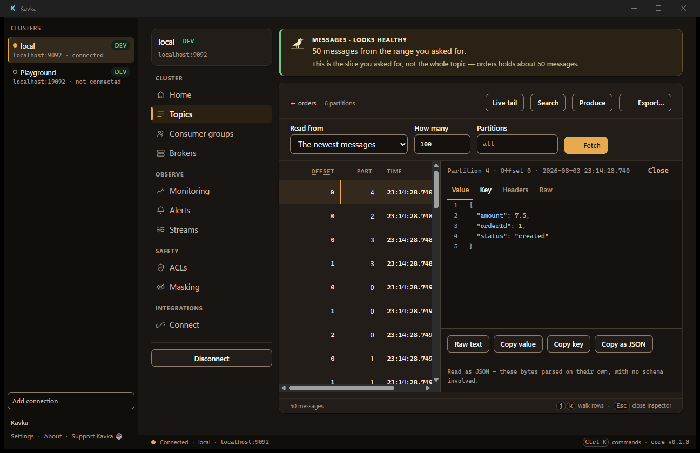
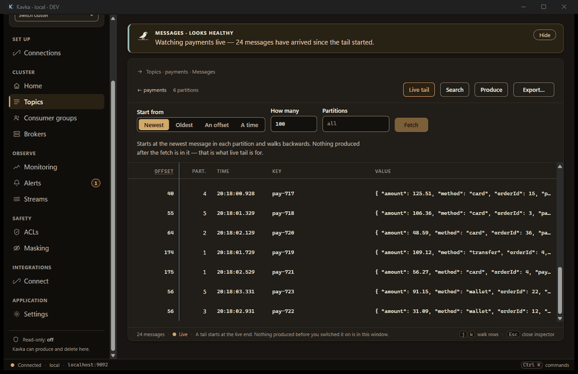
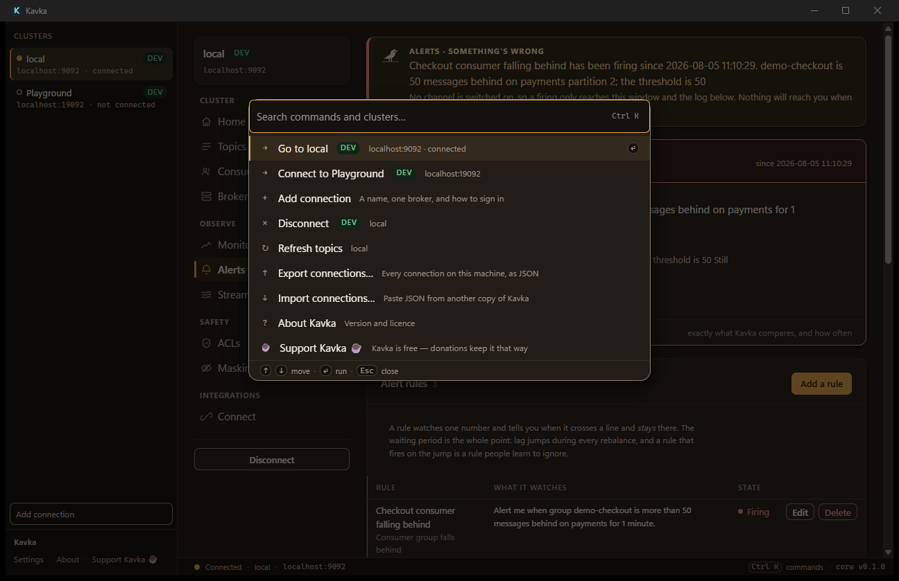
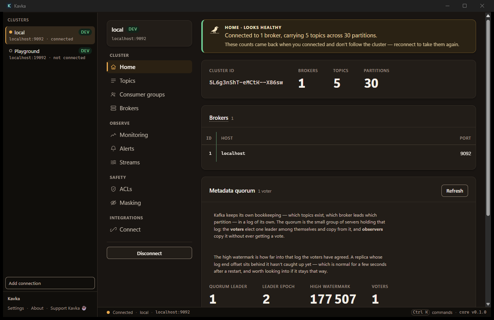
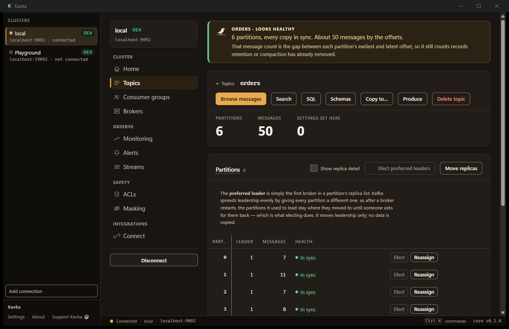
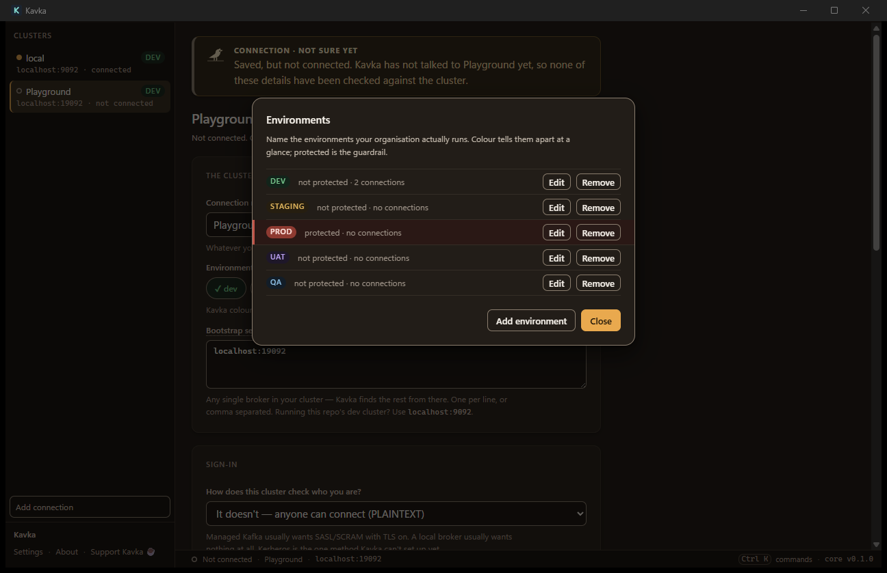
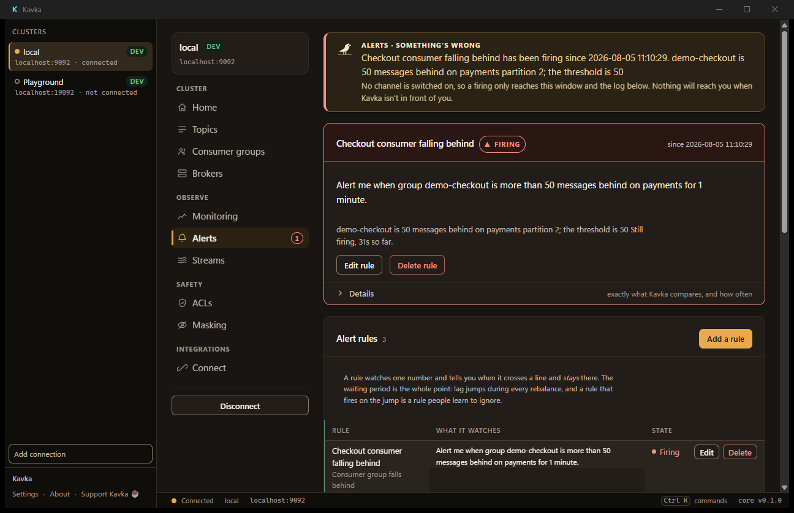
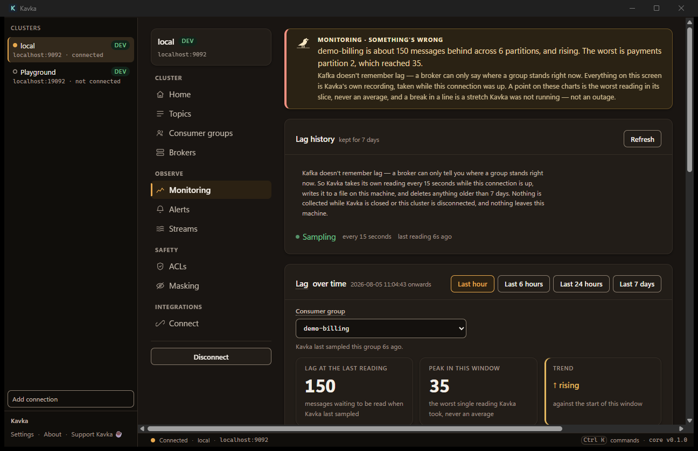
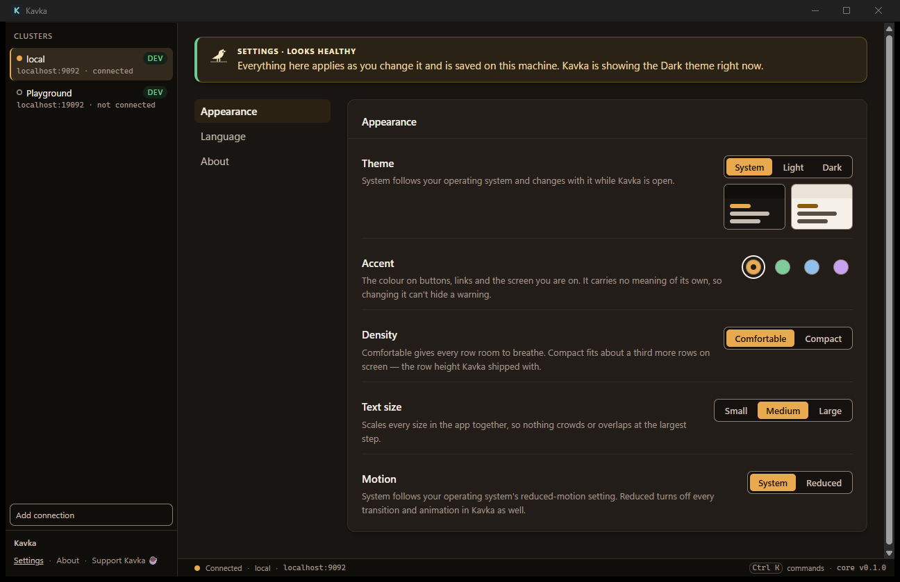
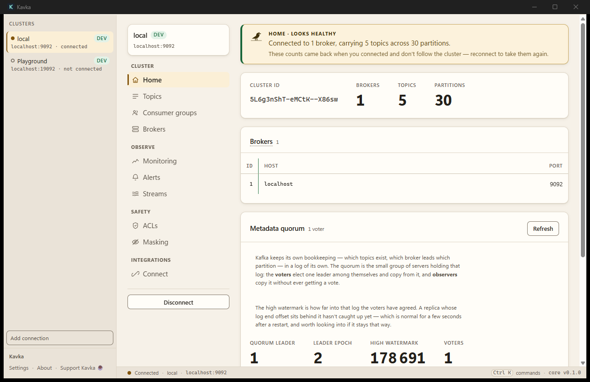

# Kavka

**A modern, fast, fully open-source Kafka desktop client for macOS and Windows.**

[](https://github.com/sahilhirani/kavka/actions/workflows/ci.yml)
[](https://github.com/sahilhirani/kavka/releases)
[](LICENSE)
[](#installing)
[](#installing)
[](#development-setup)

**[Website](https://sahilhirani.github.io/kavka/)** · **[Download](https://github.com/sahilhirani/kavka/releases/latest)** · **[Features](docs/FEATURES.md)** · **[Architecture](docs/ARCHITECTURE.md)** · **[Roadmap](docs/ROADMAP.md)**



*Every partition in one chronological table, the inspector docked on the right, and the app naming how it read those bytes instead of leaving you to guess.*



*Live tail: records land as they are produced, and the app says `Live` in words rather than only in colour.*

---

*Kavka* (Czech: jackdaw) is the bird Franz Kafka's surname comes from. The app fills the gap left by Conduktor Desktop's retirement and Offset Explorer's stagnation: a tiny, no-Docker, no-JVM desktop client that is **free for everyone — personal and commercial use alike — with every feature included**. No tiers, no license keys, no server component. If Kavka saves you time, you can [buy us a coffee](#supporting-kavka).

## Everything is in the one free app

- **Connect** — the whole auth matrix: PLAINTEXT, TLS and mTLS from PEM files with no keystore conversion, SASL PLAIN and SCRAM, OAUTHBEARER/OIDC, AWS MSK IAM, Kerberos. Secrets go to the OS keychain; per-connection read-only mode is enforced in the core, not the UI.
- **Browse & search** — unbounded streaming search across every partition (≥1M msgs/min target) with raw-byte prefilters and CEL push-down, progressive results, cancellation and cross-partition chronological sort. It never silently truncates: it says what it scanned and where it stopped.
- **Decode** — Avro, Protobuf and JSON Schema through Schema Registry (Confluent, Apicurio, Glue), plus XML, MessagePack, CBOR and hex. Every message shows the subject, version and id it was decoded with.
- **Operate** — consumer-group lag and every offset-reset mode, ACLs, client quotas, partition reassignment with throttles, preferred leader election, broker configs, the KRaft quorum, Kafka Connect CRUD and Schema Registry management.
- **Monitor** — a local sampler writes lag to an embedded store, so the charts cover last week rather than since you opened the window. Alert rules fire OS notifications and webhooks; Kafka Streams topologies render; KIP-932 share groups are visible.
- **Power tools** — SQL over a bounded scan of a topic, cross-cluster replay and config diff, consumer-offset migration, DLQ workflows, AI query generation, an MCP server, and custom decoders as sandboxed WebAssembly plugins.
- **Guardrails** — nine independent layers. Every view carries its environment's colour, and a *protected* environment (call it prod, or anything else) gets a warm red substrate and a wire down the edge that survives both themes. Destructive actions there ask you to type the name. Most incidents are right-action-wrong-cluster.
- **Plain language first** — every screen opens with a one-line verdict in English ("demo-billing is about 150 messages behind across 6 partitions, and rising"), derived from live data and honest about what it doesn't know. Jargon is explained where it appears, not in a manual.
- **Your look** — Settings holds light and dark warm themes (or follow the OS), four accent colours, comfortable or compact density, adjustable text size and reduced motion. Everything applies instantly and persists on this machine.
- **Accessibility** — built to WCAG 2.2 AA: zero contrast failures, no state encoded by colour alone, a 24px minimum hit target, full keyboard navigation, and a command palette that is the real navigation. Verified in Windows high-contrast mode.

See [docs/FEATURES.md](docs/FEATURES.md) for the complete specification, [docs/ARCHITECTURE.md](docs/ARCHITECTURE.md) for system design, and [docs/ROADMAP.md](docs/ROADMAP.md) for the phased build plan.

## What it looks like

|  |  |
| :-- | :-- |
| <br>**Command palette** — `Ctrl`/`Cmd` `K` reaches every command and every cluster. It is the real navigation, not a shortcut for it. | <br>**Home & KRaft quorum** — a grouped rail instead of a tab strip, and every screen opens with a plain-English verdict. The quorum numbers are explained in place rather than in a manual. |
| <br>**Topic detail** — partitions, leaders and health at a glance, replica detail one fold away, preferred-leader election and reassignment one click away. | <br>**Environments** — you name them, you colour them, and *protected* is the guardrail. Kavka colours every view by environment. |
| <br>**Alerts** — a rule watches one number and waits before it fires, because a rule that fires on every rebalance is one people learn to ignore. A firing rule is promoted out of the table and explained in a sentence. | <br>**Monitoring** — lag history that survives restarts, sampled locally every 15 seconds. The verdict names the worst partition; the numbers say what they are, never an average. |
| <br>**Settings** — theme, accent, density, text size and motion, applied as you click and saved on this machine. The accent note is honest: it carries no meaning of its own, so changing it can't hide a warning. | <br>**Light theme** — the whole app re-inks, dark or light, with the same contrast floors and the same guardrails. Follow the OS or pin one. |

## Installing

Prebuilt installers are attached to every [GitHub Release](https://github.com/sahilhirani/kavka/releases). Every merge to `main` publishes an automated build (tagged `v<version>-build.<n>`, marked pre-release) so the newest Kavka is always downloadable; stable versions carry a plain `v*` tag pushed by a human. Download, install, done.

| Platform | Asset | Requires |
|---|---|---|
| macOS, Apple Silicon | `Kavka_<version>_aarch64.dmg` | macOS 12 Monterey or newer |
| macOS, Intel | `Kavka_<version>_x64.dmg` | macOS 12 Monterey or newer |
| Windows, installer | `Kavka_<version>_x64-setup.exe` | Windows 10 1809 or newer, x64 |
| Windows, for fleets | `Kavka_<version>_x64_en-US.msi` | as above; installs per-machine |

Every release also carries `SHA256SUMS.txt`, so you can check what you downloaded against what CI built.

**The binaries are not code-signed yet.** On macOS, Gatekeeper says the app *"is damaged and can't be opened"* — that sentence is false, and the file's `SHA256SUMS.txt` entry proves it; it is macOS's wording for "downloaded and not notarized". After dragging Kavka to Applications, clear the quarantine flag once:

```sh
xattr -cr /Applications/Kavka.app
```

(Right-click → *Open* used to be enough; recent macOS no longer offers it for un-notarized apps.) On Windows, SmartScreen shows a warning and you need *More info → Run anyway*. That is what an unsigned build from an independent developer looks like — signing certificates cost money and identity verification, and both are on the list. Saying so here is better than letting the OS say it first.

### Package managers

Manifests are written and rendered against each release ([`packaging/`](packaging/)), but none of them is submitted yet — each ecosystem has a blocker that only a human can clear, listed in [`packaging/README.md`](packaging/README.md).

| | Command, once it lands | Blocked on |
|---|---|---|
| Homebrew | `brew install --cask kavka` | Apple notarization; homebrew-cask's notability threshold |
| winget | `winget install SahilHirani.Kavka` | Windows code-signing certificate |
| Chocolatey | `choco install kavka` (elevated — it installs the MSI per-machine) | a chocolatey.org account, and first-package moderation |

### Try it without a cluster

Kavka's first-run screen offers to start a single-node Kafka in Docker on `localhost:19092`, seed it, and save a connection called *Playground* — about thirty seconds, one click. **Kavka does not bundle a broker**: Apache Kafka is a JVM application, so bundling one means shipping a Java runtime, which is exactly what this app exists not to be. With Docker installed the button works; without it, the screen says so in one sentence rather than offering a button that cannot.

The compose file it runs ships inside the app ([`apps/desktop/src-tauri/playground/docker-compose.yml`](apps/desktop/src-tauri/playground/docker-compose.yml)) and is deliberately **not** `dev/docker-compose.yml`: the dev cluster is a test fixture with an authorizer and a feature upgrade in it, and it binds 9092, which is the port whatever Kafka you already run is on.

### What Kavka sends

Nothing. **There is no telemetry endpoint in the app** — not a disabled one, not one behind a flag. There is no analytics, no update ping, no crash reporter phoning home, and no account.

The one adjacent feature is **opt-in diagnostics**, off by default, in the About panel. Turned on, it writes rotating text files (5 files, 512 KB each, 2.5 MB total) into the app's data directory: Rust panics, uncaught errors in the window, and one line per launch with the version and OS. It never logs payloads, keys, headers or anything read out of your keychain. There is an *Open logs folder* button and a *Delete them* button beside it, and the file is plain text so you can read it before you attach it to an issue.

## The companion CLI

`kavka` is the same product without the window: it reads the connections the desktop app saved on this machine — the same `profiles.json`, the same OS keychain, the same read-only flag and the same display-masking rules — so there is nothing to configure. Point it at a saved connection and it sees exactly what the app sees.

```sh
cargo build -p kavka-cli --release    # target/release/kavka
```

```sh
kavka profiles list
kavka -p orders topics list
kavka -p orders topics detail orders
kavka -p orders fetch orders --last 20
kavka -p orders search orders "failed" --earliest
kavka -p orders search orders --cel 'value.amount > 100' --since 2h
kavka -p orders sql orders "select count(*) from messages" --earliest
kavka -p orders groups detail checkout-service
kavka -p orders produce dead-letter --key A-102 --json '{"retry":1}'
```

Seek flags mirror the app's own — `--earliest`, `--last N`, `--partition P --offset N`, `--since 2h|<epoch ms>` — and every read is bounded, with the bound reported rather than applied silently. Every numeric flag states its range in `--help` and clap enforces it, so a number past a ceiling is refused with the bound named rather than quietly clamped.

A produce payload can stay off the command line: **`--value-file <path>`** reads it from a file and `--value-file -` from standard input, because an argv is visible to every other account on the machine while the command runs and lands in the shell history afterwards — `--value`'s own help says so.

**stdout is the answer; stderr is everything Kavka has to say about it.** A terminal gets a table, a pipe gets NDJSON, and nothing has to be passed for either:

```sh
kavka -p orders fetch orders --last 100 | jq -r '.value.orderId'
kavka -p orders search orders "timeout" --earliest > hits.ndjson
```

`--output table|ndjson|json` overrides the detection; `json` is one document carrying the rows *and* the caps, progress and masking state they came with. Progress, cap notices, the masking notice and every error go to stderr, so a redirect is always clean.

Errors come from the same library the app's banners use (docs/DESIGN.md §7): a plain title, the fix, and the broker's own reply under `--details`.

| Exit | Meaning |
|---|---|
| 0 | Answered. **An empty result is still an answer** — a search with no matches exits 0, deliberately unlike `grep`. |
| 1 | The cluster, the keychain or the profile file failed. |
| 2 | The command line was wrong. |
| 3 | A guardrail refused it — read-only, or `prod` without `--yes-prod`. Nothing was sent. |
| 4 | No such connection on this machine. |

The write surface is one command, `produce`, behind two gates: a connection marked read-only refuses and no flag lifts it, and a connection tagged `prod` needs `--yes-prod` on the command line. Every command on a prod connection also prints `! PROD · <name> · <bootstrap>` to stderr first — in words, so it survives a pipe, a log and colour-blindness. There is deliberately no `delete-topic`, no config editing and no offset reset: those belong behind the app's confirmations, where the blast radius can be stated before the click.

## Your clusters, in Claude and Cursor

`kavka-mcp` is a third binary that speaks the Model Context Protocol over stdio and reads the same `profiles.json` and the same keychain. Nothing listens on a port, and nothing leaves the machine unless your assistant sends it. The About panel prints the command with the installed path already filled in:

```sh
claude mcp add kavka -- "/Applications/Kavka.app/Contents/MacOS/kavka-mcp"
```

| Tool | What it returns |
|---|---|
| `kavka_list_topics` | Every topic, with partitions and replication. |
| `kavka_fetch_messages` | Records from a seek point — at most 500. |
| `kavka_search` | A bounded scan: matches and counts, never a whole topic. |
| `kavka_sql` | SQL over a bounded scan of one topic. |
| `kavka_group_detail` | One group's members, offsets and lag. |

**It is read-only until you say otherwise.** The two tools that write — `kavka_produce` and `kavka_reset_offsets` — only exist if the client started the server with `KAVKA_MCP_ALLOW_WRITES=1`, and a production connection needs `KAVKA_MCP_ALLOW_PROD=1` as well. A connection you marked read-only refuses regardless. There is no delete, no create, no ACL change and no config change over MCP at all.

Session masking rules travel to it: redactions you configure in the app are stored beside the connection file the server reads, so they apply to what an assistant is handed — not just to what is on your screen. An assistant's context is logged, replayed and sent to somebody else's server, which is exactly why that direction matters.

## Repository layout

```
apps/desktop/           Tauri 2 desktop app (React + TypeScript UI, Rust shell)
  src/                  UI (Vite + React)
  src-tauri/            Tauri Rust shell + IPC commands
    playground/         the single-node Kafka the app can start for you
crates/kavka-core/      Rust core: connections, admin ops, consume/search engine, serdes
crates/kavka-mcp/       MCP server — the same profiles, over stdio, for AI clients
crates/kavka-cli/       `kavka` — the same profiles, on a terminal
docs/                   Product spec, architecture, roadmap, design system
docs-site/              The website. Hand-rolled HTML/CSS, no build system
packaging/              winget / Chocolatey / Homebrew manifest templates
```

## Development setup

Prerequisites:

1. **Rust** stable via rustup (`winget install Rustlang.Rustup`)
2. **Node.js ≥ 20** and npm
3. **CMake + Visual Studio Build Tools** (required when the `kafka` feature flag is enabled — rust-rdkafka builds librdkafka via cmake)
4. Tauri 2 prerequisites: WebView2 (preinstalled on Win 11); on macOS, Xcode CLT

```sh
cd apps/desktop
npm install
npm run tauri dev     # runs the desktop app with hot reload
```

### Local Kafka cluster for development & testing

```sh
docker compose -f dev/docker-compose.yml up -d --wait   # single-node KRaft Kafka on localhost:9092
```

This creates five dev topics (`orders`, `payments`, `customers`, `inventory`, `dead-letter`)
and seeds `orders` with keyed JSON messages. Data persists in a named volume;
`down -v` resets it. Integration smoke test against it:

```sh
KAVKA_IT=1 cargo test -p kavka-core --features kafka --test local_cluster
```

### Cargo features

- `kafka` (enabled by the desktop app): compiles librdkafka via `cmake-build` — needs CMake + MSVC Build Tools (`winget install Kitware.CMake`)
- `kafka-ssl`: adds TLS/SASL_SSL via vendored OpenSSL — additionally needs Strawberry Perl + NASM on Windows
- `wasm-serdes`: the sandboxed WebAssembly decoder plugin tier

App icons are generated from `assets/icon-source.png` (a placeholder "K" mark) — when a real logo exists, replace that file and re-run `npm run tauri icon assets/icon-source.png` from `apps/desktop/`.

## Contributing

Pull requests are welcome — bug fixes, serdes, auth providers, translations, and small honest improvements to the words in the UI most of all.

**Read the contract first.** [`docs/DESIGN.md`](docs/DESIGN.md) is the design system and the voice: the Jackdaw tokens, the Perch verdict every screen opens with, guardrails in words as well as colour, WCAG 2.2 AA. [`docs/ARCHITECTURE.md`](docs/ARCHITECTURE.md) is where the boundaries are: anything that talks to a broker belongs in `kavka-core`, so the app, the CLI and the MCP server all get it. A change that reads either document first is a change that gets merged quickly.

**The gate is CI, and it is the same gate on every PR** ([`.github/workflows/ci.yml`](.github/workflows/ci.yml)) — run it locally before you push:

```sh
cargo fmt --all -- --check
cargo clippy -p kavka-core --features kafka-ssl --all-targets -- -D warnings
cargo clippy -p kavka-mcp --all-targets -- -D warnings
cargo clippy -p kavka-cli --all-targets -- -D warnings
cargo test -p kavka-core --features kafka-ssl        # KAVKA_IT=1 adds the cluster tests
cd apps/desktop && npm ci && npm run build           # tsc, then vite build
```

CI runs all of that on Linux against a real single-node Kafka (`dev/docker-compose.yml`), then does a full `cargo check --workspace` on Windows, where librdkafka is built through CMake. Warnings are errors. If a test needs a broker it is gated behind `KAVKA_IT=1` so a laptop with no Docker still runs the rest.

Open an issue before a large change so nobody writes the same thing twice.

## Supporting Kavka

Kavka is free and open source, and always will be — no paid tiers, no feature gates. Development is funded by donations:

☕ **[Buy Me a Coffee](https://buymeacoffee.com/sahilhirani)**

The app itself carries a small, unobtrusive "Support Kavka ☕" link in its About panel and command palette — never a nag screen.

## License

[AGPL-3.0](LICENSE). Free to use anywhere — personally or commercially. Copyleft: if you distribute a modified Kavka, or offer one as a network service, you must publish your source under the same license. **No closed-source forks.**

Kavka is not affiliated with or endorsed by the Apache Software Foundation; Apache Kafka is a trademark of the ASF.

## Status

**Public, pre-1.0.** Feature-complete through the roadmap — every phase in [docs/ROADMAP.md](docs/ROADMAP.md) is built, including the polish pass — and the version is `0.1.x` for an honest reason: it has been run against dev clusters and CI's, not against yours. Expect bugs, and please [report them](https://github.com/sahilhirani/kavka/issues).

Distribution is prepared but not executed — everything below needs a human, money or an account, and none of it can be done from this repository:

- **The site** — live at [sahilhirani.github.io/kavka](https://sahilhirani.github.io/kavka/), deployed from [`docs-site/`](docs-site/) by [`.github/workflows/pages.yml`](.github/workflows/pages.yml). The one thing still missing is a 1200×630 Open Graph card of its own.
- **A domain** — `kavka.io` was verified unregistered on 2026-08-02. Registering it and adding a `CNAME` to `docs-site/` is a human action.
- **macOS** — Apple Developer Program membership, a Developer ID Application certificate, and `notarytool` credentials in the release workflow. Until then the `.dmg` is unsigned and Gatekeeper says the app is "damaged", which is the wrong message for the truth.
- **Windows** — an OV or EV code-signing certificate. Until then SmartScreen warns on every first run.
- **Package managers** — a fork and a pull request each for winget-pkgs and homebrew-cask, a chocolatey.org account and API key. Manifests are rendered onto every release; see [`packaging/README.md`](packaging/README.md).
